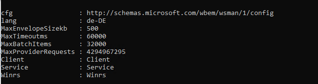

## Overviews

In Windows Server 2025, when managing remote systems through the **Server Manager**, you may encounter the following error message:


 

> **Online – Error Retrieving File**

This error often occurs when the **Windows Remote Management (WinRM)** service on the target system exceeds certain request sizes or when the default configuration is too restrictive. The result is that the Server Manager cannot retrieve complete system data.

---

## Cause

The Server Manager uses the **WinRM protocol** (Windows Remote Management) to communicate with remote systems.  
By default, the WinRM stack defines a maximum packet size (`MaxEnvelopeSizekb`) of **500 KB**. For systems with many installed roles, features, or extensive WMI responses, this value may be too low – the Server Manager then aborts the retrieval with the mentioned error.




---

## Solution

The error can be resolved by increasing the allowed envelope size on the **target system**.  
This is done using the following PowerShell command, which must be run **with administrative privileges**:

```powershell
Set-WSManInstance -ResourceURI winrm/config -ValueSet @{MaxEnvelopeSizekb = "8192"}
```
